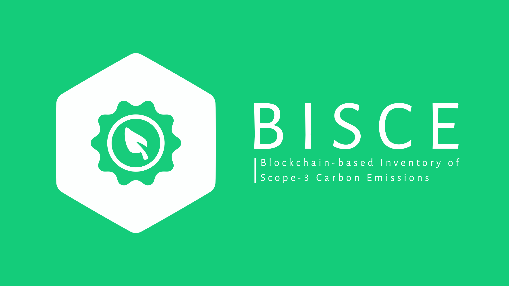

# BISCE: A Simple, Fast, and Dynamic Blockchain Service Deployment Solution


## Overview
**Warning: Do not use this project in production purposes.**

This repository contains the source code of a web-based platform called "Blockchain-based Inventory of Scope-3 Carbon Emissions". The platform is designed to simulate carbon transactions between users on the Hyperledger Fabric blockchain. It has a React frontend and a Django backend and allows users to interact with an ERC-20 smart contract deployed on chain. 

This project is still under development, and we welcome any suggestions for improvement. Your feedback is valuable, and we appreciate your contribution to the project's development.

If you want to understand more detail and also happen to be able to read in traditional Chinese, you can check out the powerpoint [here](https://docs.google.com/presentation/d/18R2ygUikURfjTdJtzM67ym33f1UPxzSckpC85smQbc0/edit?usp=sharing). Nevertheless, you can get most of the information about how to set up this project in the following description.

[Video list about BISCE](https://youtube.com/playlist?list=PLuFrURqtW_6uIeKtf4eoqPLbVJGZwA10t&si=yDfMG0jmVk7g8FNJ)

## Environment
The only environment used in experiments is Ubuntu 20.04. Any problem caused by trying to set this up in different environments is unknown.

## Prerequisite
* git

* curl

* Docker

* Docker-compose

* python3.9

* python3.9 venv

* jq

    You can install all of these by the following comments on Ubuntu:

    ```bash
    $ sudo apt-get update
    $ sudo apt-get install git curl docker-compose python3.9 python3.9-venv jq -y
    $ sudo systemctl start docker
    $ sudo usermod -a -G docker <username>
    $ sudo systemctl enable docker
    ```

    Otherwise, you should check their docs to make sure how to install them in your system properly.

* [npm](https://github.com/nvm-sh/nvm)

    The npm version should not be too old, or it may cause bugs. (Specific version is unknown.)

* [tar](https://www.gnu.org/software/tar/)

* [go](https://go.dev/doc/install)

## Installation
1. Go to the directory you want to install this.

1. Clone this repository:
    ```bash
    $ git clone https://github.com/dodo920306/BISCE.git
    ```

Now you're ready to set this up.

## Get Started
As you might notice, the directory structure can be splitted into three main parts:

1. blockchain
1. backend
1. frontend

This is the exact order you should follow to build up the project. Consequences of any other order are unknown.

Before we get into it, you should consider that you want to be a channel joiner or creater. That is, the following steps will be different from your identity. Because currently the multi-channel network is not supported yet, your organization cannot be a channel joiner and creater at the same time.

If you're a channel creater, I assume that you should be the network creater at the same time. That means you should bring up an overlay network with Docker Swarm. You should get your network ip first and run

```bash
$ sudo docker swarm init --advertise-addr <your ip address>
$ sudo docker network create --attachable --driver overlay bisce-network
```

You shouldn't change the network name from "bisce-network".

If you want to let others join the network, please run

```bash
$ sudo docker swarm join-token manager
```

and give the output instructions to them.

If you're a joiner, follow the output from the above command run by the creater, with your own ip.

```bash
$ <output from join-token manager> --advertise-addr <your ip>
```

### Blockchain
Go to the directory.

```bash
$ cd BISCE/blockchain
```

Run the initialization.

```bash
$ ./init.sh
```

It will ask your organization's name and hostname. Please remember them because we will use them later. Neither of them should be as same as others'.

The script should generate the config files that will be used later according to your input.

Set up the organization CA and containers.

```bash
$ ./setup.sh
```

You may want to check what this has done by

```bash
$ sudo docker ps
```

If nothing wrong, you should have four containers running as your `peer`, `orderer`, `couchdb` (ledger), and `ca`.

If you're a creater, run

```bash
$ ./createChannel.sh
```

After that, you may see a tarball called `deliver.tar.gz`, that will be the file you need to give to a joiner.

Please note that this tarball can only be used once. If you give it to two joiners, the later one will fail to join the channel.

The preferred way to invite third organization into the channel is use the second member's deliver directory as a tarball after it joined the channel.

The preferred way to invite forth organization into the channel is use the third member's deliver directory as a tarball after it joined the channel...and so on.

As a joiner, once you get `deliver.tar.gz`, you should place it under your `BISCE/blockchain` directory.

Then run

```bash
$ tar -zxvf deliver.tar.gz
```

You may notice that a directory named `deliver` has been created under the `BISCE/blockchain` directory. Run

```bash
$ cd deliver
$ chmod +x inviteChannel.sh joinChannel.sh
$ ./inviteChannel.sh
```

to create the channel config that includes your organzations.

After that, you may notice that there is a file named `update_in_envelope.pb` has been created, and you should give it to a organization that is already in the channel.

As a organization that is already in the channel, place the `update_in_envelope.pb` given by the joiners under the `BISCE/blockchain` directory and use

```bash
$ sudo docker exec -e CORE_PEER_MSPCONFIGPATH=/etc/hyperledger/users/admin/msp $(sudo docker ps --filter "name=^peer0.*" --format "{{.Names}}") peer channel signconfigtx -f /etc/hyperledger/update_in_envelope.pb
```

to sign for the config, and use

```bash
$ sudo docker exec -e CORE_PEER_MSPCONFIGPATH=/etc/hyperledger/users/admin/msp $(sudo docker ps --filter "name=^peer0.*" --format "{{.Names}}") peer channel update -f /etc/hyperledger/update_in_envelope.pb -c biscechannel1 -o $(sudo docker ps --filter "name=^orderer0.*" --format "{{.Names}}"):7050 --tls --cafile /etc/hyperledger/peers/peer0/tls/ca.crt
```

to update the channel to include the joinners once you're sure that more than half of members in the channel has signed for it.

**Note: the `peer channel signconfigtx` command signs the config *in place*, which means that a joiner can't just deliver the updated config to all member in the channel and ask them to sign it and update the channel. It must give the updated config to one single member in the channel first, ask it to sign it gently, and ask it to give the config it signed to the next member to sign, and so on. Every time a member has signed the config, the `update_in_envelope.pb` will be different from what it originally was as it carrys all the signatures inside itself. No one can update the channel until a member gets the config and is sure that it contains signatures of half of members.**

Once the joiners are sure that they are in the channel, run

```bash
$ ./joinChannel.sh
```

under the deliver diretory to let themselves in.

After that, you can use

```bash
$ cd ..
$ tar -zcvf deliver.tar.gz deliver
```

to make a tarball under `BISCE/blockchain` that you can deliver to next member who wants to join the channel. The original `deliver.tar.gz` won't make it because the config block in it isn't latest anymore.

#### The chaincode

As you can see there's a directory named `chaincode` under the blockchain directory. The chaincode inside will be installed when `createChannel.sh` or `joinChannel.sh` are executed for channel creaters and joiners respectively. Nevertheless, the content inside the chaincode does not matter to the set up process, so you can change it as you like if you want to. However, the website set up later is specifically designed for the original chaincode, so once you change the content you should not use the website here anymore. Also, please remember to change every chaincode content of all members that is/will be in the channel once you change one. If a member's chaincode content is different from others', some conflicts might happen.

The chaincode here was designed while consulting [ERC-20](https://github.com/hyperledger/fabric-samples/tree/main/token-erc-20), [ERC-1155](https://github.com/hyperledger/fabric-samples/tree/main/token-erc-1155), and [High-Throughput Network](https://github.com/hyperledger/fabric-samples/tree/main/high-throughput) farbic-samples. It makes it nearly impossible to encounter a MVCC CONFLICTs while using it. Please consult all these samples first if you want to contribute the chaincode.

It basically manages 2 tokens, a standard ERC-20 token and a Soulbound one. While using `use` and `useFrom`, you turn your own ERC-20 token to the recipient's Soulbound one. The reason why it was designed like that is detailed in the powerpoint mentioned in Overview.

#### Note
All scripts in the `BISCE/directory` directory we use here are independent for the other parts of the project. That means you can use this to build your own Hyperledger Fabric network on multi-host.

#### Troubleshooting
All logs can be seen by

```bash
$ ./logs.sh
```

If you encounter a tls problem, you may want to consult [this](https://stackoverflow.com/questions/76990991/tls-handshake-failed-with-error-eof-when-deploying-hyperledger-fabric-on-multi-h).

### Backend
Once the blockchain has been set up, you may consider set up the backend next.

Go to the directory.

```bash
$ cd ../backend
```

Set up the virtual environment.

```bash
$ python3.9 -m venv env
$ . env/bin/activate
```

Install the requirements.

```bash
$ pip install -r requirements.txt
```

Run the server.

```
$ python3.9 manage.py migrate
$ python3.9 manage.py runserver 0.0.0.0:8000
```

Keep the shell process alive to keep it on, or you might consider use `screen` to run it in the background.

You can open another shell to set up frontend next.

### Frontend
Go to the directory.

```bash
$ cd ../frontend
```

Install the requirements.

```bash
$ npm install --force
```

Run the webpage.

```bash
$ npm start
```

Keep the shell process alive to keep it on, or you might consider use `screen` to run it in the background.

Now, go to `http://<your ip>:3000` to see the website. You can sign up users there and login in to do transactions.

## Usage
The current project is kind of buggy and isn't designed while considering security.

Therefore, as mentioned before, **please do not use this in production purposes.** The only purpose to use this is experiments and development.

## Improvement
The following is the improvements you may consider to contribute.

* Add [bft consensus that is about to be integrated into the Fabric ordering service for the v3.0 preview release](https://toc.hyperledger.org/project-reports/2023/2023-Q3-Hyperledger-Fabric.html)

* Upgrade the backend as a WSGI server. Also, make the website a systemmd service.

  I myself will choose gunicorn & nginx to do it.

* Debug

* Remove redundant code

* Make the whole thing secure

* Add [hyperledger explorer](https://github.com/hyperledger-labs/blockchain-explorer)

* Make multi-channel available

Happy hacking!
